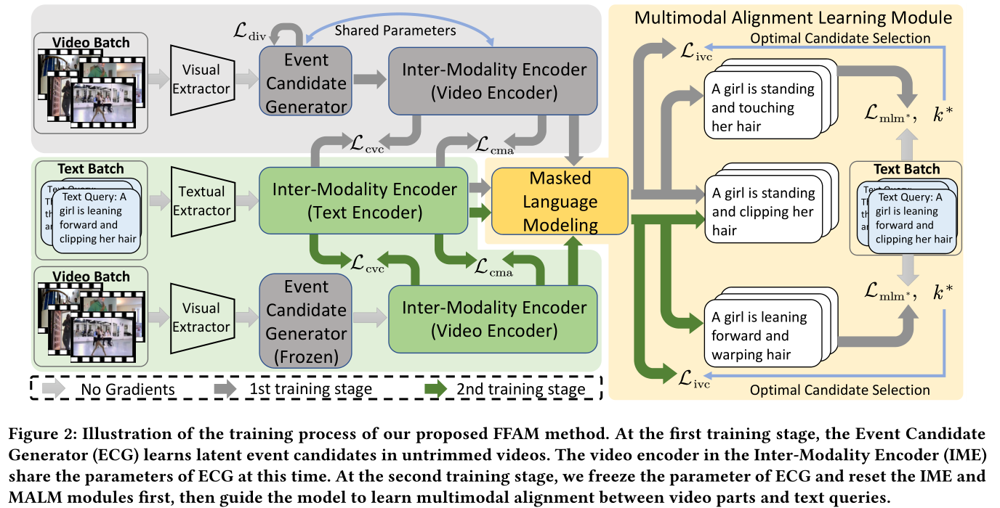
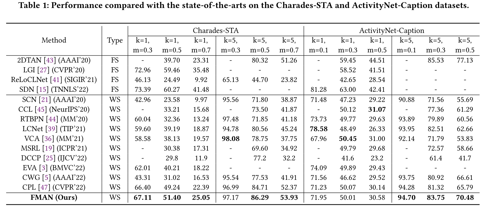
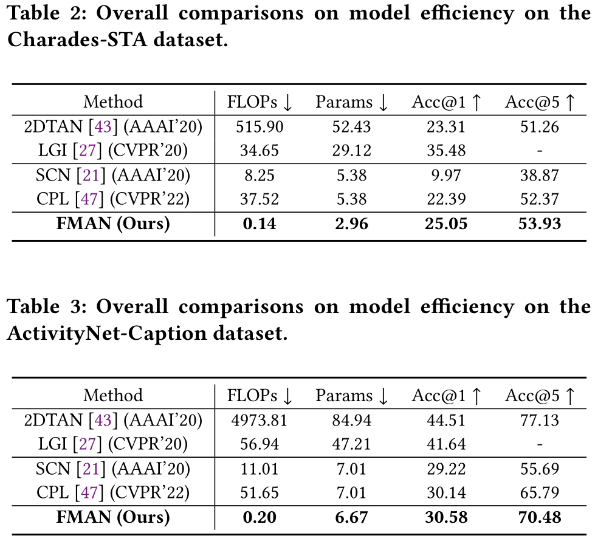
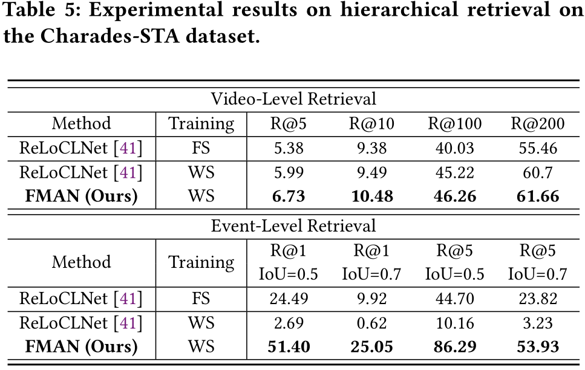
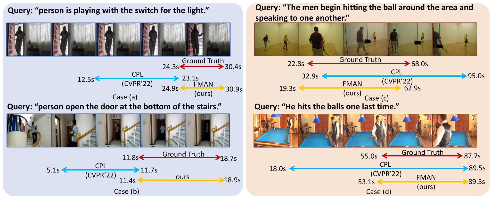

# Introduction

This is our anonymous implementation codes of *" Fusion-free Multimodal Alignment Network for Weakly-Supervised Video Moment Retrieval"* (FMAN).

## Fusion-free Multimodal Alignment Network

  Weakly-Supervised Video Moment Retrieval (WSVMR) aims at retrieving a specific event from an untrimmed video with a given text query.  
  As annotating the temporal boundaries are subjective and expensive, it follows weakly-supervised settings in that learning from video-text matching supervision directly.  
  Most existing WSVMR methods widely adopted multimodal fusion understanding video content thus further aligning two modalities.  
  In this work, we propose a novel Fusion-free Multimodal Alignment Network method, termed FMAN, which tackles the WSVMR task efficiently.  
  Specifically, our FMAN method consists of three key modules: (1) Event Candidate Generator that learns latent video parts related to the target event in the video; (2) Inter-Modality Encoders that conduct context modeling within text or video modality rather than unified multimodal representation; (3) Multimodal Alignment Learning Module which employs contrastive learning and masked language modeling to align partial video and text query embeddings.  
  Moreover, we limit the complex cross-modal interactions within the training stage thus our model tackles the WSVMR task efficiently.  
  The experimental results on two widely used WSVMR benchmarks, i.e., Charades-STA and ActivityNet-Caption, demonstrate our method outperforms current state-of-the-art methods.  
  Extensive further analysis also shows that it achieves competitive video-level retrieval performance on the Charades-STA dataset.  



<!-- **Insight of Our Work** -->
## Insight of Our Work

1. We propose a novel Fusion-free Multimodal Alignment Network method that tackles the WSVMR problem. It successfully bypass the complicated multimodal fusion in test stage thus achieving much higher efficiency and saving more computational resources.  
2. We design a Multimodal Alignment Learning Module which can be flexibly applied to learn cross-modal alignments between videos and texts. Moreover, it effectively limits all cross-modal interactions within training stage.  
3. Extensive experiments on two widely used WSVMR datasets demonstrate our proposed method outperforms recent state-of-the-art methods.  
4. Our FMAN framework also supports video-level retrieval, which is superior to most existing WSVMR models. The experimental results show that the FMAN achieves competitive performance on the Charades-STA dataset.  

# Data Preparation  

We employ pre-trained I3D model to extract the video features.  
As our paper is under review, you can follow current published VMR works to deploy the off-the-shelf I3D features.  
Please remember to pack them into hdf5 file and modify the feature path in our config files:  

```Json
"feature_path": "path_to_hdf5_files/extracted_features.hdf5",
```

# Training and Testing

## Running

Please use the following command to train our model:  

```Python
## Charades-STA
python train.py --config-path config/charades/i3d.json --tag FMAN --log ./log/charades/
```

If you want to evaluate a pre-trained model, please use the following command:

```Python
python train.py --config-path config/charades/i3d.json --tag FMAN --log ./log/charades/ --resume $checkpoint/charades/model-t2m-best.pt$ 
```

# Comparisons on Accuracy and Efficiency of Video Moment Retrieval

<!-- **Results on Charades-STA Dataset** -->
## Results on the Charades-STA and ActivityNet-Caption Datasets



## Comparisons on Model Efficiency



<!-- **Visualization of What Our Model Care** -->
## Video-level Retrieval Results on the Charades-STA Dataset



## Visualization of Moment Retrieval


